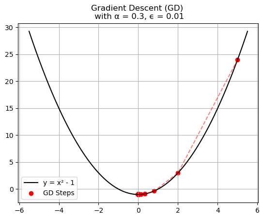
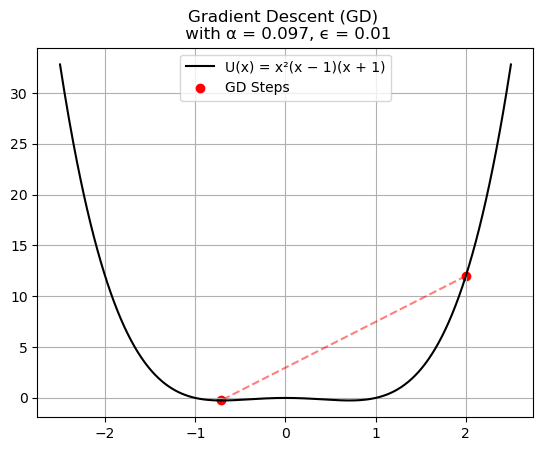
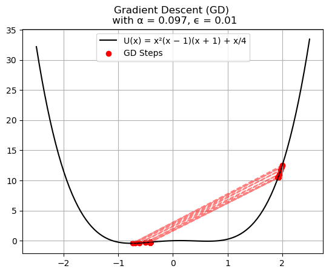
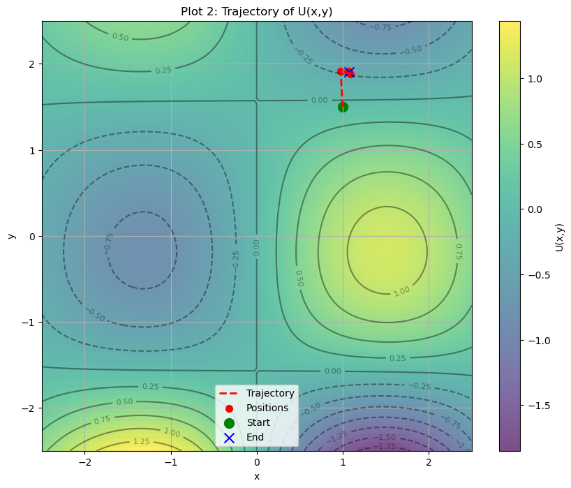
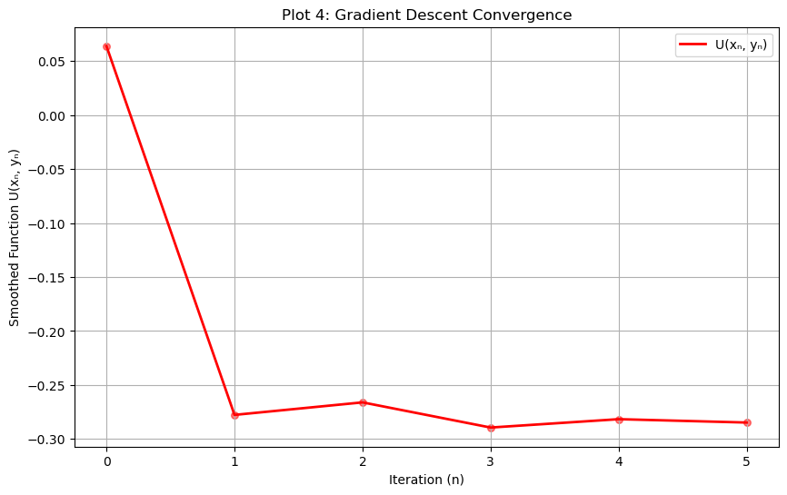

# Gradient Descent

This folder contains four activities designed to deepen your understanding of optimization for polynomial and sinusoidal functions by exploring the impact of the learning rate on gradient descent.

## Exercise 1:

The first function is

$$U(x) = x^2 - 1$$

### Example

From what is made in the code one can see that increasing the learning rate decreases the number of Gradient Descent steps needed to reach the minimum of the function.

## Exercise 2:

The second function is

$$U(x) = x^2(x - 1)(x + 1)$$

### Example

As in Exercise 1, increasing the learning rate increases the number of Gradient Descent steps. However, since the function in Exercise 2 has two minima, the value of $\alpha$ will determine which minimum Gradient Descent will tend towards.

## Exercise 3:

The third function is

$$U(x) = x^2(x - 1)(x + 1) + \frac{x}{4}$$

### Example 3.1

The linear term $\frac{x}{4}$, which differentiates the functions from Exercises 2 and 3, is responsible for smoothing the curve, allowing a higher learning rate for this function.

## Exercise 4:

The fourth function is

$$U(\vec{r}) = U(x, y) = \sin(x)\cos(y) + \frac{2(xy)^2}{1000}$$

### Example 4.1

One can see that the chosen parameters result in Gradient Descent converging to a minimum region, as expected.

### Example 4.1

The plot of the value of $U(x_{n}, y_{n})$ at each step as a function of the iterations (steps) $n$ shows that with the increase in the learning rate and the initial point, there is some oscillation in the convergence trajectory of GD.

Through these activities, I learned that the value of the learning rate is extremely important for the accuracy of gradient descent.
