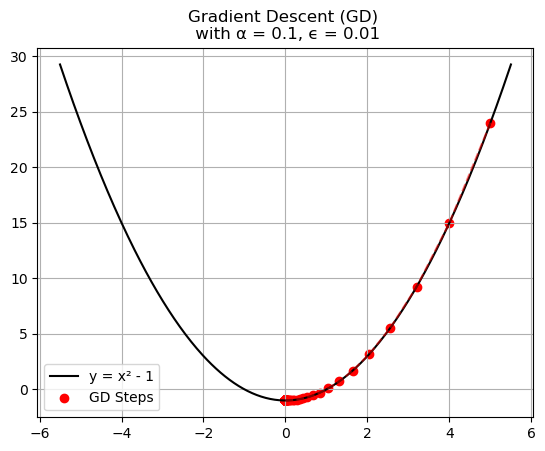

# Gradient Descent

This folder contains four activities designed to deepen your understanding of optimization for polynomial and sinusoidal functions by exploring the impact of the learning rate on gradient descent. Through these activities, I could comprehend that the value of the learning rate is extremely important for the accuracy of gradient descent.

