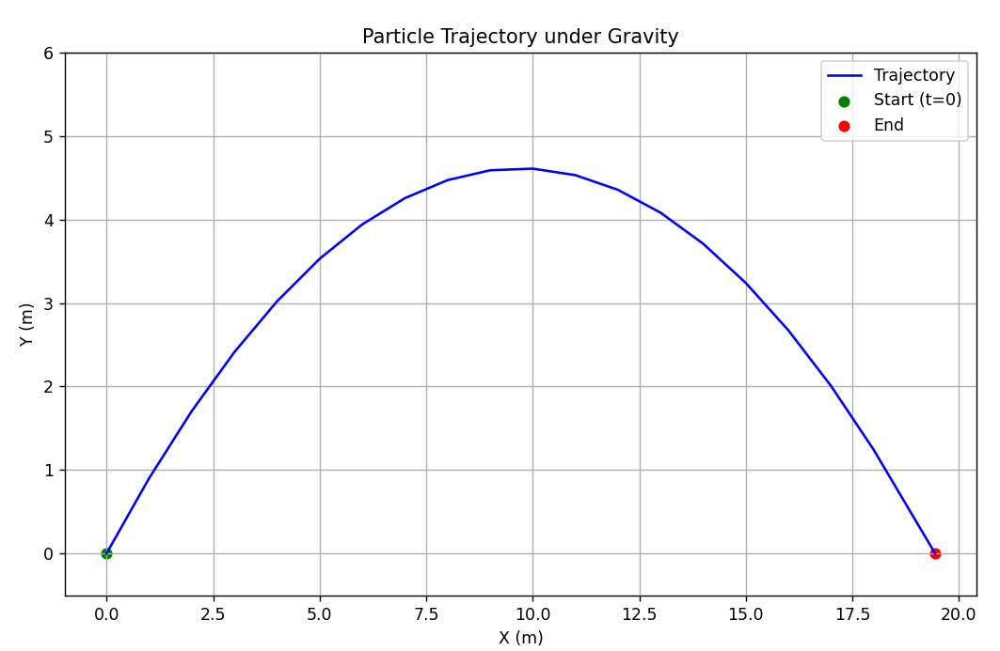

This activity provides an opportunity to use object-oriented programming in Python by creating a class that represents a particle in 2D. The objective is to use this class to simulate oblique motion using Newton's Second Law. The provided code simulates and plots the trajectory of a particle launched with an initial velocity under gravity. It updates the particle’s position and velocity at each time step, stops when the particle hits the ground, and uses linear interpolation to find the exact landing point. The result is a plot showing the full path from launch to landing.

The result can be seen below

