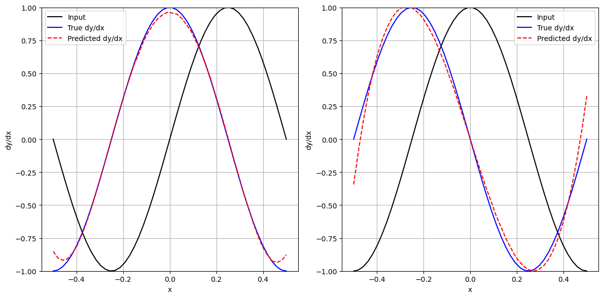

## Simple neural network

This activity involves building a machine learning model using polynomial functions to approximate sinusoidal functions. The Mean Squared Error (MSE) is used as the loss function, with the 'Adam' optimizer and 'tanh' activation function. The main objective is to train the model to interpolate polynomial functions. Additionally, the activity analyzes how the number of layers, neurons, and other parameters affect the results. You can vary the number of neurons, layers, and other parameters of the MLPRegressor. For training, 80% of the dataset is randomly selected, with the remaining 20% used for testing. It is important to note that using too many layers may lead to overfitting.

The result can be seen below

